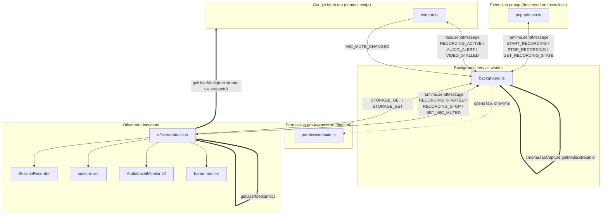
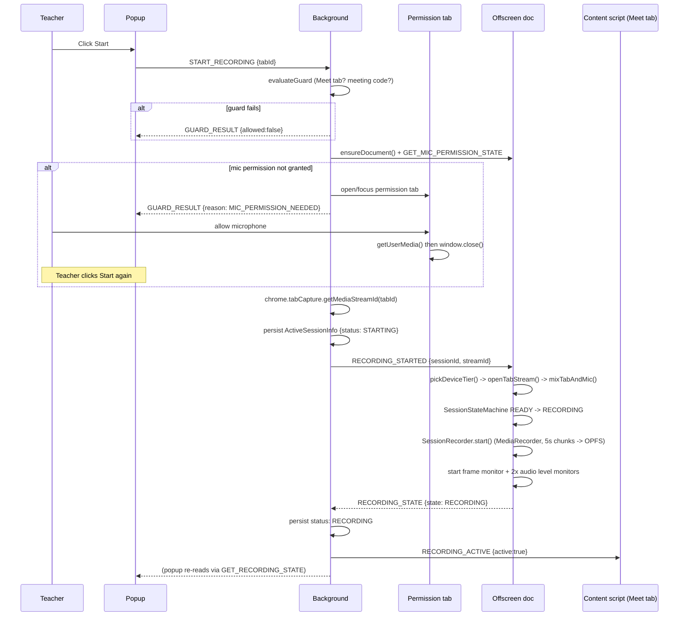
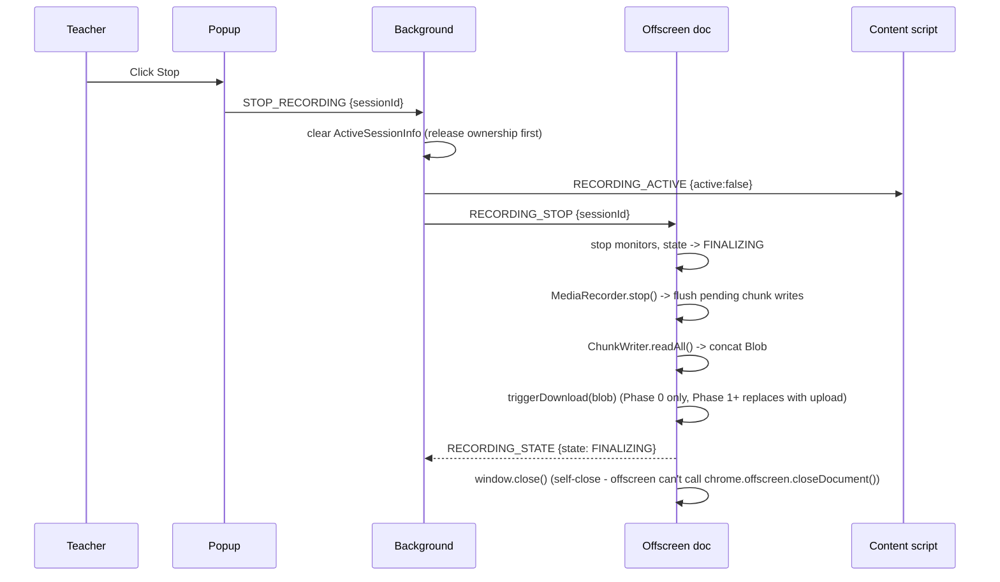
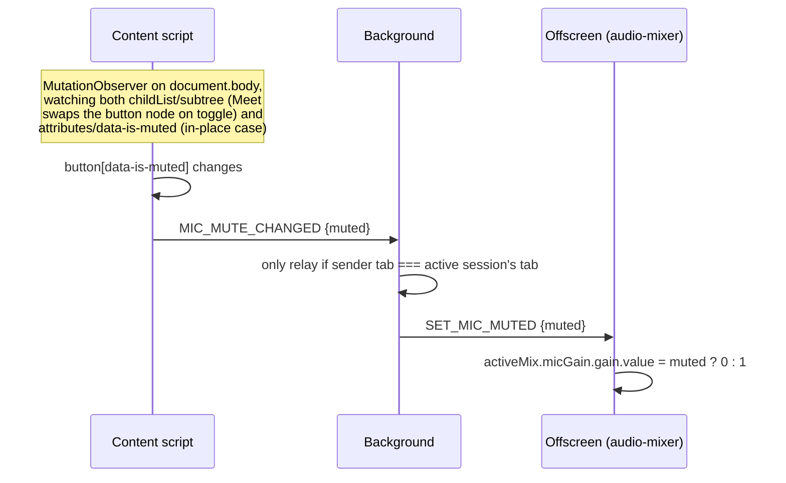

# 1Study Class Recorder — Architecture (v1, Phase 0)

Status: Phase 0 complete (Task 4's 60-min soak test deferred). Documents the
extension as built and human-tested against real Google Meet calls.

Spec: [`docs/superpowers/specs/2026-08-26-meet-recorder-extension-design.md`](../specs/2026-08-26-meet-recorder-extension-design.md)
Plan: [`docs/superpowers/plans/2026-08-26-meet-recorder-extension-phase0.md`](../plans/2026-08-26-meet-recorder-extension-phase0.md)

## 1. What this extension does

Records a Google Meet class tab (video + student/class audio) via
`chrome.tabCapture`, mixes in the teacher's own microphone (captured
independently via `getUserMedia`, since Meet's tab audio never contains the
local participant's own voice), encodes to WebM chunks written to OPFS, and
(Phase 0 only) concatenates and downloads the result as a single file at
stop. Upload to the sibling `1study-recording` backend is out of scope until
a later phase.

## 2. Component map

Background is the **sole router and sole owner of session state**. Popup,
content script, and offscreen document never talk to each other directly —
everything is background → X or X → background. This exists because
`browser.runtime.sendMessage` reaches every extension page (background,
popup, offscreen) except the sender, but never a content script; the only
way to reach a content script is `browser.tabs.sendMessage(tabId, …)` from
background. Command messages (background→offscreen) and control messages
(popup→background) deliberately use different type tags so a popup
broadcast can never be mistaken for a command by the offscreen document.

## 3. Start-recording sequence

## 4. Stop-recording sequence

## 5. Mic-mute detection (Meet's own mute button)

Meet's own mute button stops Meet's WebRTC pipeline, but has **no effect** on
this extension's independent `getUserMedia()` mic capture — without explicit
handling, the recording keeps the teacher's voice through a mute that
Meet's own UI shows as off.

Fails soft: if Meet ever changes this markup, the button is simply never
found and recording continues exactly as it does today, just without mute
detection — never a hard failure.

## 6. File / module responsibility table

### Entry points (`entrypoints/`)

| File | Context | Responsibility |
|---|---|---|
| `background.ts` | Service worker | Sole message router. Owns `ActiveSessionInfo` (persisted to `chrome.storage.local` — survives service-worker death mid-session). Runs the tab guard, mic-permission check, `tabCapture.getMediaStreamId`, opens the permission tab, fans alerts out to the recorded tab, relays `MIC_MUTE_CHANGED`→`SET_MIC_MUTED` scoped to the active session's tab only. |
| `content.ts` | Injected into `meet.google.com/*` | Watches Meet's mute button (`watchMicMuteButton`), shows/hides an in-page banner for audio/video alerts, tracks `visibilitychange` to warn the teacher how long they were away from the tab (informational only, never blocks). |
| `offscreen/main.ts` | Offscreen document | Owns all live media/recording logic: opens the tab stream at the tier's resolution/fps, mixes it with the mic via `audio-mixer`, drives `SessionRecorder`, `SessionStateMachine`, frame monitor, and two `AudioLevelMonitor`s (mic + tab). One in-flight session at a time; a second `RECORDING_STARTED` while one is active is refused. |
| `popup/main.ts` | Popup UI | Stateless by necessity — MV3 destroys the popup instantly on focus loss (which happens the moment the teacher clicks back into the Meet tab). Re-reads background's persisted state (`rehydrate()`) on every open rather than holding its own. Runs the local tab guard for instant UI feedback, but the authoritative guard check happens in background. |
| `permission/main.ts` | Real tab, opened on demand | Exists solely to call `getUserMedia({audio:true})` from a context that can actually show Chrome's native permission prompt — offscreen documents have no visible surface and can never show it themselves. Stops its own track and self-closes once granted (or denied). |

### Shared (`src/shared/`)

| File | Responsibility |
|---|---|
| `messages.ts` | The `Message` discriminated union — every cross-context message, with a routing-model comment explaining why command vs. control messages use different type tags. Also `GuardFailureReason`, `ActiveSessionInfo`, response types. |
| `config.ts` | All tunable constants (`CONFIG`): chunk size, tier thresholds/resolutions/bitrates, stall/silence thresholds, timeouts. `pickMimeType()` picks the first supported WebM codec for a tier. |

### Core logic (`src/core/`, pure/unit-tested, no `chrome.*`)

| File | Responsibility |
|---|---|
| `tab-guard.ts` | `evaluateGuard()` — is this tab Meet, does its meeting code match the scheduled one. |
| `device-tier.ts` | `pickDeviceTier()` — LOW/MID/HIGH from `hardwareConcurrency` + `deviceMemory`, with unknown-memory treated as low/mid boundary rather than assumed HIGH. |
| `state-machine.ts` | `SessionStateMachine` — enforces the legal session-state graph (`IDLE→READY→RECORDING→FINALIZING→…`), persists each transition. |
| `stall-detector.ts` | `StallDetector` — frame-gap detection (R13). `checkForStall()` polling only starts after the first real `onFrame()`, to avoid false positives from tabCapture's initial decode warm-up. |
| `silence-tracker.ts` | `SilenceTracker` — accumulates silent seconds, fires ALERT/RECOVERED at a threshold. |
| `rms.ts` | `computeRms()` / `isSilent()` — plain signal-level math. |
| `event-reporter.ts` | `EventReporter` — queues `RecordingEvent`s to storage (serialized via a promise tail, so concurrent reporters can't race-drop each other) and emits them on an `EventBus`. |
| `event-bus.ts` | Minimal typed pub/sub. |
| `meeting-code.ts` | `isMeetUrl()` / `extractMeetingCode()` — URL parsing only. |
| `result.ts` | `Result<T, E>` helper type (`ok`/`err`/`isOk`/`isErr`). |
| `assert.ts` | `assertNever()` — exhaustiveness checks in every message-handling switch. |
| `logger.ts` | `createLogger(scope)` — leveled console logging. |

### Offscreen logic (`src/offscreen-logic/`, needs DOM/media APIs, unit-tested against fakes)

| File | Responsibility |
|---|---|
| `audio-mixer.ts` | `mixTabAndMic()` — opens the mic stream, mixes tab + mic audio via `AudioContext` gain nodes into one `MediaStream`, routes tab audio to speakers so the teacher still hears students. Returns `micGain` so mute-detection can zero it live. Throws `MicrophoneAccessError` with a user-facing message keyed off the `getUserMedia` error name. |
| `recorder.ts` | `SessionRecorder` — wraps `MediaRecorder`, picks mime type from the tier's codec list, chunks every `CONFIG.CHUNK_MS`, writes each chunk via `ChunkWriter`, waits for all pending writes before reading the file back on stop. |
| `chunk-writer.ts` | `ChunkWriter` — one OPFS file per chunk; `readAll()` skips any chunk whose write failed and reports which indices are missing rather than throwing. |
| `frame-monitor.ts` | `startFrameMonitor()` — hidden `<video>` + `requestVideoFrameCallback` feeding `StallDetector`, plus a `setInterval` poll (safe here — offscreen documents aren't throttled the way backgrounded tabs are) to catch a stall even if no frame ever arrives. |
| `audio-monitor.ts` | `AudioLevelMonitor` — `AnalyserNode` polling, RMS → `SilenceTracker` → ALERT/RECOVERED events. |

### Adapters (`src/adapters/`)

| File | Responsibility |
|---|---|
| `chrome-api.ts` | `ChromeTabCaptureApi`, `ChromeOffscreenApi` (thin wrappers so `background.ts` can be unit-tested against fakes), `getActiveTab()`. |
| `storage.ts` | `KeyValueStore` interface; `ChromeStorageAdapter` (real `chrome.storage.local`, background only); `InMemoryStore` (tests). |
| `messaging-storage.ts` | `MessagingStorageAdapter` — the **only** storage path available to the offscreen document. Offscreen documents can use `chrome.runtime` and nothing else (confirmed against Chrome's own docs: "The runtime API is the only extensions API supported by offscreen documents") — so every read/write proxies through background via `STORAGE_GET`/`STORAGE_SET`. |

## 7. Message catalog (`src/shared/messages.ts`)

| Type | Direction | Purpose |
|---|---|---|
| `START_RECORDING` | popup → background | Request to start; carries `tabId`. |
| `STOP_RECORDING` | popup → background | Request to stop; carries `sessionId`. |
| `GET_RECORDING_STATE` | popup/content → background | Pull current `ActiveSessionInfo` + last error (rehydration). |
| `MIC_MUTE_CHANGED` | content → background | Meet's own mute button toggled on the sender's tab. |
| `RECORDING_STARTED` | background → offscreen | Command: begin capturing/mixing/recording. Carries `sessionId`, `streamId`. |
| `RECORDING_STOP` | background → offscreen | Command: finalize and self-close. |
| `GET_MIC_PERMISSION_STATE` | background → offscreen | Query `navigator.permissions.query({name:'microphone'})`. |
| `SET_MIC_MUTED` | background → offscreen | Relay of `MIC_MUTE_CHANGED`, scoped to the active session's tab only. |
| `STORAGE_GET` / `STORAGE_SET` | offscreen → background | Proxy onto `chrome.storage.local` (see `messaging-storage.ts`). |
| `RECORDING_STATE` | offscreen → background (+popup) | Session-state ack/update: `RECORDING` / `FAILED` / `FINALIZING` / etc. |
| `AUDIO_ALERT` | offscreen → background → content | Mic or tab audio has gone silent / recovered. |
| `VIDEO_STALLED` / `VIDEO_RECOVERED` | offscreen → background → content | Frame-stall detector fired/cleared (R13). |
| `RECORDING_ACTIVE` | background → content | Tells the content script whether *this* tab is currently being recorded. |
| `GUARD_RESULT` | background → popup | Why a start was refused (or that it was allowed). |

## 8. Key constraints this design satisfies

- **Offscreen documents: `chrome.runtime` only.** No `chrome.storage`, no
  `chrome.offscreen` (must self-`window.close()`), no other `chrome.*`
  namespace. Every offscreen persistence need routes through background.
- **No `audioCapture`/`videoCapture` manifest permission exists** for
  standard (non-Chrome-Apps) extensions. Mic access instead goes through a
  real permission tab running `getUserMedia`, which shares its origin's
  grant with the offscreen document.
- **Popups are destroyed on focus loss** and hold no durable state; they
  always rehydrate from background.
- **`browser.tabs.sendMessage` is the only path to a content script** —
  `runtime.sendMessage` reaches every other extension page but never a
  content script.
- **Background owns and persists session state** so it survives the
  service worker being killed and restarted mid-session; a `STARTING`
  session that never acks within `CONFIG.STARTING_ACK_TIMEOUT_MS` is
  treated as abandoned and reclaimable.
- **R13 (frame stalls):** detection-only was validated sufficient — see
  Phase 0 test results below. No dedicated-window forcing implemented.

## 9. Phase 0 human-verification results

| Task | Scenario | Result |
|---|---|---|
| 2 | Camera grid capture | Pass (HIGH tier) |
| 3 | Audio quality, both directions | Pass (after mute-detection fix) |
| 4 | Device-tier selection | Pass (HIGH tier correctly selected). 60-min soak + VP9/VP8 A/B **deferred**, not yet run. |
| 5 | Tab guard (5 cases): extension only enables on Meet tabs; `tabCapture` only triggers on explicit user action | Pass |
| 6 | Tab-switch freeze (R13) — same-window tab switch, 2 min away | Pass, no crash/freeze |
| 6 | Meet in its own unfocused window, 2 min | Pass, no freeze |
| 6 | Chrome minimized entirely, 2 min | Pass, no freeze (view scales/renders correctly on restore) |
| 6 | Active screen-share + tab switch | Pass, no freeze |

**Conclusion (R13 decision):** no freeze observed under any tested
backgrounding condition. Detection-only (banner + `VIDEO_STALLED`/
`VIDEO_RECOVERED`) is sufficient; forcing Meet into a dedicated
`chrome.windows.create` window is **not required** for Phase 1.

## 10. Known deferred items going into Phase 1

- Task 4's 60-minute soak test and VP9/VP8 codec A/B comparison — not yet run.
- Broader refactor/simplification pass across message handlers and
  entrypoints, explicitly deferred by the user until all Phase 0 testing
  passed.
- Upload path to the `1study-recording` backend (ffmpeg merge + S3) —
  entirely out of scope for Phase 0; `triggerDownload()` in
  `offscreen/main.ts` is a smoke-test stand-in to be replaced.
